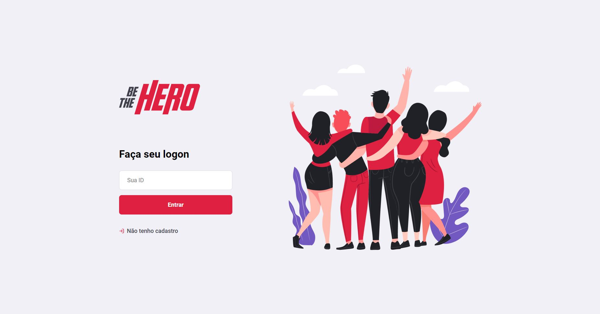

<h1 align="center">
    
</h1>

<h1 align="center">
    
</h1>

## 📝 Sobre

O projeto **Be The Hero** tem a ideia de que ONG's se cadastrem e criem seus casos (pela plataforma WEB) para que as pessoas consigam ajudar (pelo aplicativo)!

---

## 🚀 Tecnologias Utilizadas

- [ReactJS](https://reactjs.org)
- [React Native](https://reactnative.dev)
- [NodeJS](https://nodejs.org/en/docs/guides/getting-started-guide/)
- [SQLite](https://www.sqlite.org/index.html)

---

## 💻 Baixar e Executar o Projeto

```bash

    # Clonar o repositório do GIT
    $ git clone https://github.com/maumauagain/Be-The-Hero

    # Acessar o diretório contendo o projeto
    $ cd Be-The-Hero

    # Acessar o diretório contendo o backend do projeto
    $ cd backend 

    # Instalar as dependências do backend do projeto
    $ npm install

    # Iniciar o projeto backend
    $ npm start

    # Acessar o diretório contendo o frontend do projeto
    $ cd frontend 

    # Instalar as dependências do frontend do projeto
    $ npm install

    # Iniciar o projeto frontend
    $ npm start

    # Acessar o diretório contendo o mobile do projeto
    $ cd mobile 

    # Instalar as dependências do mobile do projeto
    $ npm install

    # Iniciar o projeto mobile
    $ npm start

```

---

<h4 align="center"> Desenvolvido por [Amauri Martins](https://www.linkedin.com/in/amauri-martins-júnior-73090a169/) ⚓ </h4>


